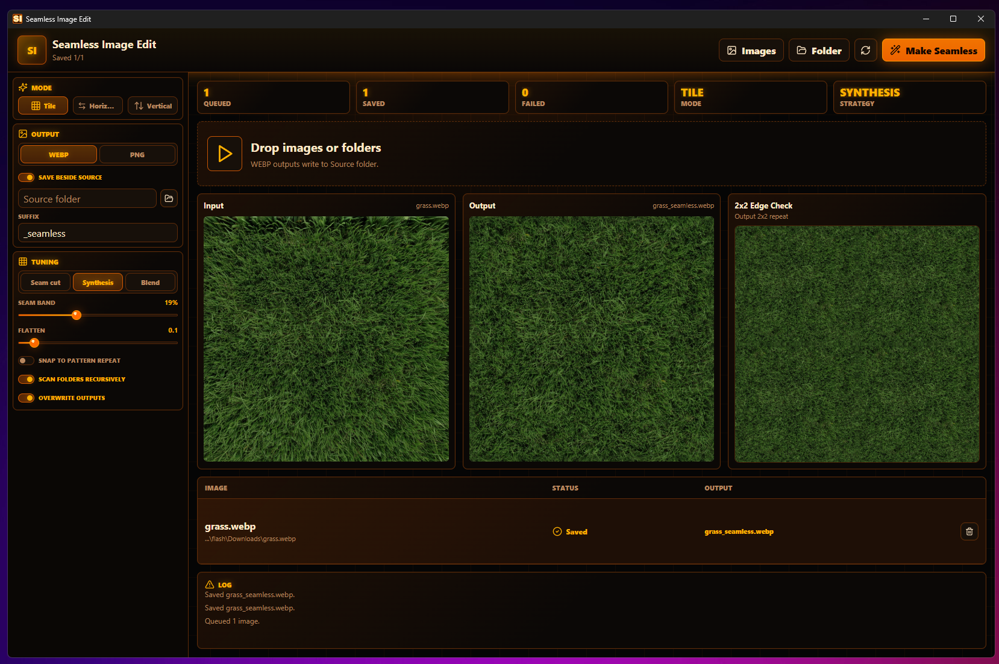

# Seamless Image Edit

Local desktop tool for turning source images into horizontally seamless, vertically seamless, or fully tileable outputs.



## Features

- Drag and drop images or folders
- Open individual images or scan folders recursively
- Make horizontal seams, vertical seams, or all four tile edges seamless
- Choose seam-cut, synthesis, or blend strategies per batch
- Optional low-frequency flattening for photo-derived lighting gradients
- Optional pattern-repeat snapping for bricks, tiles, and other grid-like textures
- Save as WebP by default or PNG
- Save beside the source image by default, or choose a separate output folder
- 2x2 tile preview to inspect repeat edges, including dropped comparison images

## Which Strategy Should I Use?

Use `seam-cut` first for structured patterns: bricks, tile grids, planks, panels, fabric, masonry, stripes, and anything where lines should stay crisp. This is the best default for brick textures because it avoids a wide ghosted crossfade across mortar lines.

Use `synthesis` for organic or stochastic textures: grass, moss, dirt, gravel, foliage, bark, stone, clouds, noise, and other surfaces where a regenerated patch can hide better than a hard structural cut.

Use `blend` for quick, soft, low-detail cases: blurry backgrounds, noisy surfaces with no clear shapes, subtle gradients, or source images that are already almost seamless. It is the weakest general-purpose option and is not recommended for bricks, stripes, text, or visible geometry.

Enable `Snap to pattern repeat` for bricks, tiles, and grid-like textures when the source contains a partial repeat at the right or bottom edge. If a repeat is detected, the app crops to a whole number of repeats before seam repair; if not, the output row reports that no partial repeat was found.

## Algorithm

The default seam repair path is `seam-cut`. It rolls the image so the old outer seam moves to the center, then cuts between the rolled layer and the original layer along a minimum-error path with a tiny feather. Most pixels come from one layer or the other rather than a wide crossfade, which preserves structured textures like planks, brick rows, and fabric better than a blended seam. A final edge snap makes opposite outer pixels match exactly. Horizontal mode repairs left/right borders, vertical mode repairs top/bottom borders, and tile mode repairs all four borders.

`synthesis` keeps the older Embark Studios `texture-synthesis` path for stochastic textures where inpainted noise can look better than a cut. If texture synthesis cannot complete for a file, the backend falls back to `seam-cut` so the batch can keep moving.

`blend` keeps the older deterministic offset-and-crossfade repair. It is fast and predictable, but can create ghosted detail on structured images, so it is best treated as a simple fallback for forgiving textures.

Flattening is optional and runs before the selected seam strategy. It estimates a broad illumination field and subtracts part of it, which helps photo-derived textures with vignettes or directional lighting. Leave it off for already-flat art unless a lighting gradient is visible in the 2x2 tile preview.

Pattern-repeat snapping is optional and runs before flattening and seam repair. It looks for repeated color or structural edge layout along the active axes, then crops away partial repeats when it can do so confidently.

Test fixtures are written to `src-tauri\target\visual-seam-test` during `cargo test`. They include deliberately harsh non-seamless inputs, seam-cut outputs, 2x2 repeats, and before/after contact sheets for visual inspection.

## Development

```powershell
npm install
npm run dev
```

## Headless CLI

The desktop binary can also process images without opening the GUI:

```powershell
src-tauri\target\debug\seamless-image-edit.exe --headless `
  --mode horizontal `
  --strategy seam-cut `
  --flatten 0 `
  --format webp `
  --output-dir D:\out `
  --suffix _seamless `
  --overwrite `
  D:\textures\road.png
```

Modes are `horizontal`, `vertical`, or `tile`. Strategies are `seam-cut`,
`synthesis`, or `blend`; the default is `seam-cut`. Use `--flatten <0..1>` for
illumination flattening, `--snap-period` for repeat snapping, `--recursive` for
folders, and `--same-folder` to save outputs beside each source image.

## Desktop Build

```powershell
npm run tauri:build
```

The Windows installer is written under `src-tauri\target\release\bundle\nsis`.

## License

MIT
